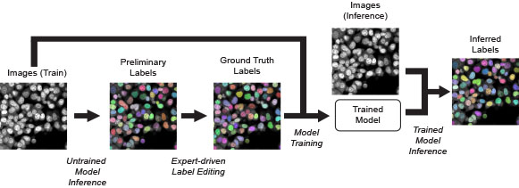
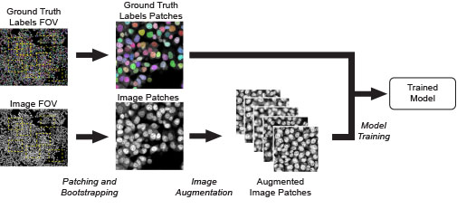
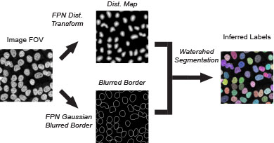
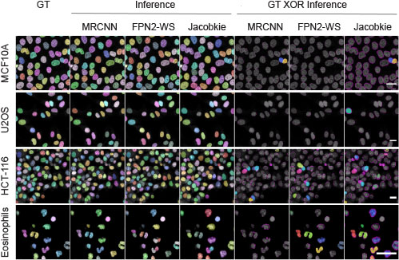

# Practical Deep Learning for Nucleus Segmentation

### Abstract:

Deep learning is rapidly becoming the technique of choice for automated segmentation of nuclei in biological image analysis workflows. In order to improve and understand the training parameters that drive the performance of deep learning models trained on small, custom annotated image datasets, we have designed a computational pipeline to systematically test different nuclear segmentation model architectures and model training strategies. Using this approach, we demonstrate that transfer learning and tuning of training parameters, such as the training image dataset composition, size and pre-processing, can lead to robust nuclear segmentation models, which match, and often exceed, the performance of existing, state-of-the-art deep learning models pre-trained on large image datasets. Our work provides computational tools and a practical framework for the improvement of deep learning-based biological image segmentation using small annotated image datasets. 

### Pipeline:

Schematic representation of the  computational  pipeline  used  to  train  deep  learning  nuclear  instance  segmentation models  and  to  use  these  to  predict  nucleus  labels.  When  present,  nuclear  labels  are pseudocolored to represent different instances.

Image augmentation strategy. Random overlapping patches are oversampled from full Fields of View (FOV) of grayscale images and of nuclear labels images. These patches are then augmented by randomly applying a variety of affine, translational, intensity and blurring transformations. The augmented dataset  is  then  used  for  supervised  training  of the  deep  learning  nuclear  segmentation models.

Schematic of the FPN2-WS architecture.The FPN2-WS architecture uses two deep learning models to predict a normalized nucleus distance transform image, and a blurred nucleus border image. These images are then used as the seed and border for a traditional watershed segmentation algorithm. 

### Results Highlights:

Nuclear segmentation inference performance of the optimized training strategy for the MRCNN and FPN2-WS model architectures, and comparison to the pre-trained Jacobkie  model  architecture. The  images below represent pseudocolored nuclear labels for the ground truth (GT) annotations and for the models inference  results.  Additionally,  the  GT  XOR  Inference  panels  represent  pseudocolored full labels for false negatives at an Intersection over Union (IoU) threshold of 0.7. For true positiveand false positive objects at the same threshold, only the difference at the pixel level between GT and inference labels is shown in magenta.  Scale bar: 20 μm.

### Repo description:

The pipeline is shared as a reference implementation in this repo. 
The [inference](./inference), [visualization](./visualization), and [supervisely](./supervisely-wrapper) scripts can run on typical laptop.

Here is the description of the repo:

* [Inference](./inference): examples on how to use the models in inference mode for [mrcnn](./inference/mrcnn/demo/demo.ipynb) and [FPN+watershed](inference/watershed/demo/demo.ipynb)

* [Visualization](./visualization): Regenerate the [figures](./visualization/highlight-inference.ipynb) and [plots](./visualization/DL_Nuc_Segment_Plots/DL_Nuc_Seg_Results.md) shown in the paper. 

* [Supervisely Wrapper](./supervisely-wrapper): code required for exporting/importing preminelary annotation and ground truth from supervisely.

* [Image Augmentation](image-augmentation): configurable augmentation wrapper implemented around imgaug.

* [MRCNN](./mrcnn): a forked version of Matterport MRCNN implemenation with our addition for the model's parameter we used for training, and the postprocessing pipeline after inference. The inference part is demonstrated in the [inference](./inference) directory.

* [Feature Pyramid Netwoks](./fpn): configurable wrappers, generators, and training around models we used to predict the distance transform and the blurred contour. We used the [segmenation-models](https://github.com/qubvel/segmentation_models) library.

* [Pipeline](./pipeline): the Snakemake pipeline that we used to conduct our experiments on [NIH Biowulf](https://hpc.nih.gov/) HPC cluster. Some of the rules in the pipeline uses [Knime](https://www.knime.com/) workflows shown in this [directory](./knime) This implementation is provided for reference only. 
