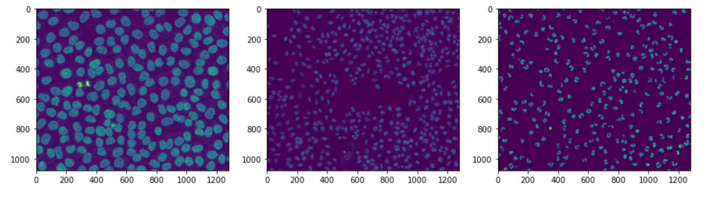
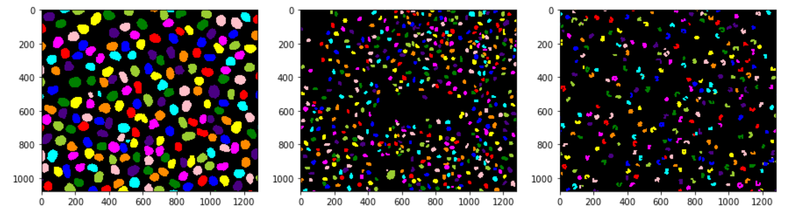

# Inference of Cell Object Detection and Segmentation
This is an inference implementation on Python 3, Keras, and TensorFlow. The model generates bounding boxes and segmentation masks for each instance of an object in the image. It's based on Feature Pyramid Network (FPN), ResNet101, MRCNN, Gaussian Blurred border, and Distance Map model.

## Input:

## Output:


The folder includes:
* Jupyter notebooks of inference built on [MRCNN](https://arxiv.org/abs/1703.06870).
* Jupyter notebooks of inference built on Gaussian Blurred border and Distance Map Models.

# Installation
1. Clone this repository
```bash
  git clone git@github.com:CBIIT/nci-hitif.git
  cd nci-hitif
   ```
If you are using MAC, please install libtiff package using [Brew](https://brew.sh/).
```bash
  brew install libtiff
   ```
2. Create Virtual Conda Enviroment using Anaconda.

**Option1: NO GPU (e.g., If you are using MAC, mostly, you don't have CUDA support):**
```bash
   conda create -n hitif python=3.7
   pip install -r framework-nucleus-segmentation/mrcnn/requirements.txt
   ```

**Option2: CUDA:**
```bash
   conda create -n hitif python=3.7
   pip install -r framework-nucleus-segmentation/mrcnn/requirements_gpu.txt
   ```   
3. Activate Virtual Environment.
```bash
   conda activate hitif
   ```
   
4. Run Dependency (MRCNN Package) setup script.
```bash
  cd framework-nucleus-segmentation/mrcnn
  python3 setup.py install
  cd ../..
   ```
5. Download datasets. Downloaded dataset will be located at **framework-nucleus-segmentation/visualization**
```bash
   python3 framework-nucleus-segmentation/visualization/Download-and-Unzip.py
   ```
6. Now, you are ready for running demos. Please use Jupyter Notebook using created Python environment.

Watershed-FPN:
```bash
   cd framework-nucleus-segmentation/inference/watershed/demo
   jupyter lab demo.ipynb
   ```
MRCNN:
```bash
   cd framework-nucleus-segmentation/inference/mrcnn/demo
   jupyter lab demo.ipynb
   ```

# Source Code:
## MRCNN Inference:
```bash
   nci-hitif/framework-nucleus-segmentation/inference/mrcnn/src/mrcnn_infer.py
   ```
## FPN-Watershed Inference:
```bash
   nci-hitif/framework-nucleus-segmentation/inference/watershed/src/watershed_infer.py
   ```


# Demo
* Jupyter notebook (MRCNN): [Here](https://github.com/CBIIT/nci-hitif/blob/master/framework-nucleus-segmentation/inference/mrcnn/demo/demo.ipynb)

* Jupyter notebook (FPN-Watershed): [Here](https://github.com/CBIIT/nci-hitif/blob/master/framework-nucleus-segmentation/inference/watershed/demo/demo.ipynb)
