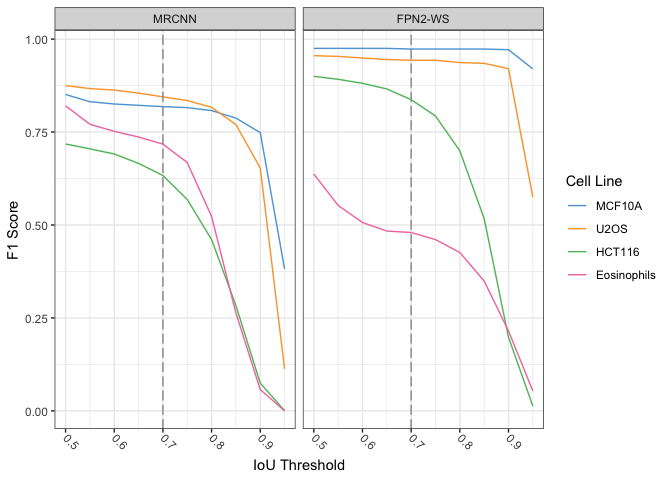
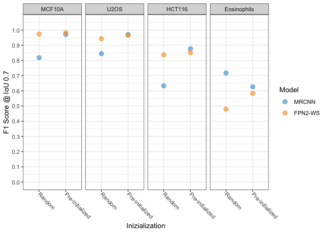
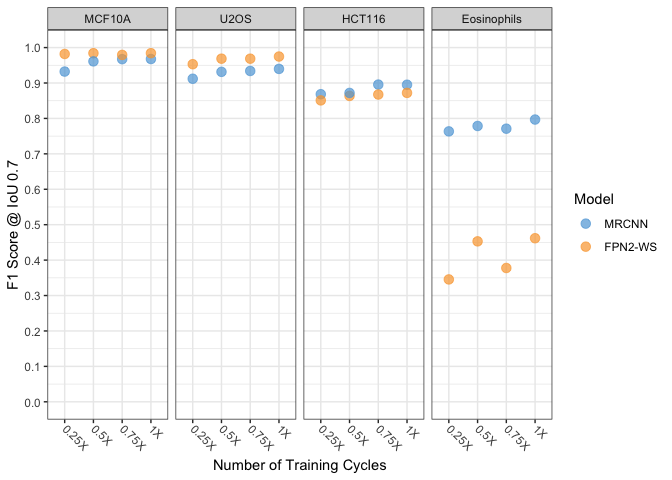
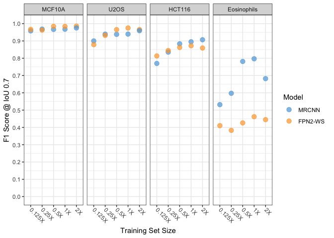
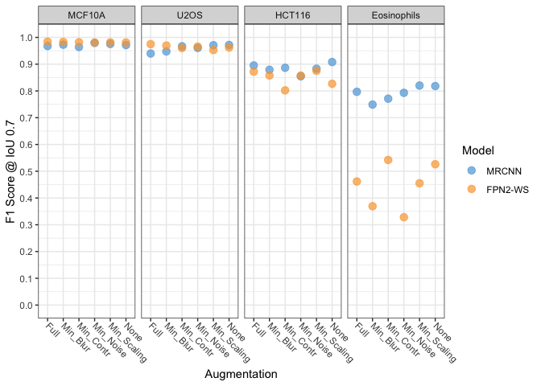
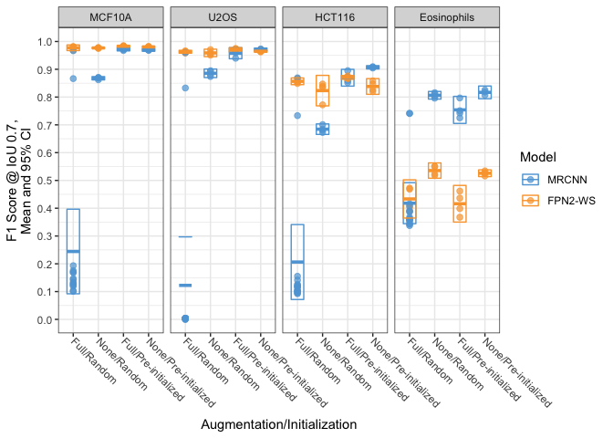
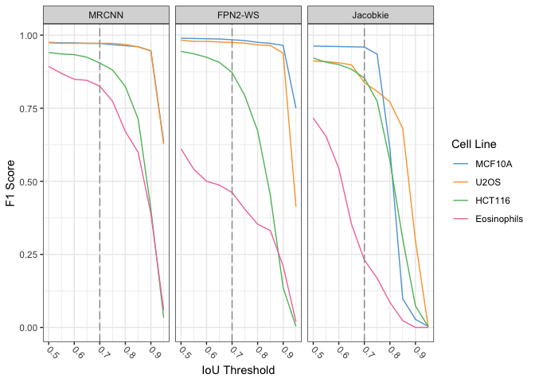
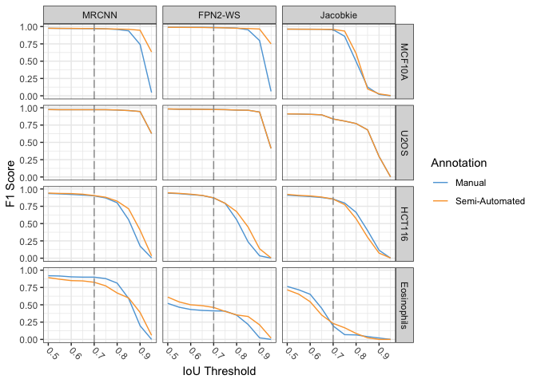

Generation of Figures 1 to S1 for the DL Nuclear Segmentation Manuscript
================
Jun 19 2020

### Analysis initialization

Load the required libraries

``` r
library(tidyverse)
```

    ## ── Attaching packages ───────────────────────────────────────────────────────────────────────────────────────────── tidyverse 1.3.0 ──

    ## ✓ ggplot2 3.3.1     ✓ purrr   0.3.4
    ## ✓ tibble  3.0.1     ✓ dplyr   1.0.0
    ## ✓ tidyr   1.1.0     ✓ stringr 1.4.0
    ## ✓ readr   1.3.1     ✓ forcats 0.5.0

    ## ── Conflicts ──────────────────────────────────────────────────────────────────────────────────────────────── tidyverse_conflicts() ──
    ## x dplyr::filter() masks stats::filter()
    ## x dplyr::lag()    masks stats::lag()

``` r
library(readr)
library(curl)
```

    ## 
    ## Attaching package: 'curl'

    ## The following object is masked from 'package:readr':
    ## 
    ##     parse_date

``` r
library(ggthemes)
```

Set `knitr` and `ggplot2` options.

``` r
knitr::opts_chunk$set(
    cache = FALSE,
    fig.path = "Output/",
    dev = c("png", "pdf"),
    message = FALSE,
    warning = FALSE
    )

theme_set(theme_bw())

theme_update(
  axis.text.x = element_text(
    angle = -45,
    hjust = 0,
    vjust = 0.5
  ),
  axis.text.y = element_text(hjust = 0)
)
```

### Read and process data and metadata

Define a function to calculate the F1 score based on the number of true
positives, false positives and false negatives.

``` r
calculate_F1 <- function(tp, fn, fp){
  tp/(tp + (fn + fp)/2)
}
```

Download unzip the input results of the inference experiments from
Figshare.

``` r
URL <- "https://ndownloader.figshare.com/files/23026505" 
curl_download(URL, "data.zip")
unzip("data.zip") 
```

Recursively read ands process all the data from all the paper runs.

``` r
raw_tbl <- dir(path = "Data", 
               pattern = ".*\\.csv$", 
               recursive = TRUE,
               full.names = TRUE) %>%
  set_names() %>%
  map_df(read_csv, .id = "filename") %>%
  select(filename, 
         thres = `IoU(Threshold)`,
         TP = `Sum(all_tp)`,
         FP = `Sum(all_fp)`,
         FN = `Sum(all_fn)`,
         mAP = AP) %>%
  mutate(F1 = calculate_F1(tp = TP,
                           fn = FN,
                           fp = FP))
```

``` r
glimpse(raw_tbl)
```

    ## Rows: 7,450
    ## Columns: 7
    ## $ filename <chr> "Data/run001/mean-average-precision/mrcnn/BABE_Biological/ma…
    ## $ thres    <dbl> 0.50, 0.55, 0.60, 0.65, 0.70, 0.75, 0.80, 0.85, 0.90, 0.95, …
    ## $ TP       <dbl> 1116, 1113, 1113, 1111, 1109, 1105, 1103, 1097, 1089, 919, 9…
    ## $ FP       <dbl> 28, 31, 31, 33, 35, 39, 41, 47, 55, 225, 36, 36, 36, 36, 36,…
    ## $ FN       <dbl> 23, 26, 26, 28, 30, 34, 36, 42, 50, 220, 0, 0, 0, 0, 0, 0, 0…
    ## $ mAP      <dbl> 0.9562982, 0.9512821, 0.9512821, 0.9479522, 0.9446337, 0.938…
    ## $ F1       <dbl> 0.9776610, 0.9750329, 0.9750329, 0.9732808, 0.9715287, 0.968…

Recode the values of the `cell_line` variable to make them compatible
with the actual cell names used in the experiments.

``` r
levs1 <- c("MCF10A", "U2OS", "HCT116", "Eosinophils")
levs2 <- c("Original", "Technical", "Biological", "Technical_manual", "Biological_manual")

raw_tbl <- raw_tbl %>%
           mutate(filename = str_replace(filename, "BABE", "MCF10A"),
                    filename = str_replace(filename, "HiTIF_Colorectal", "HCT116"),
                    filename = str_replace(filename, "HiTIF_Laurent", "U2OS"),
                    filename = str_replace(filename, "Manasi", "Eosinophils"),
                    run = as.numeric(str_match(filename, pattern = "run([0-9]{3})")[,2]),
                    cell_line = str_match(filename, pattern = "Data/.*?/.*?/.*?/(.*?)_.*?/")[,2],
                    replicate = str_match(filename, pattern = "Data/.*?/.*?/.*?/.*?_(.*?)/")[,2],
                    cell_line = factor(cell_line, levels = levs1),
                    replicate = factor(replicate, levels = levs2))

glimpse(raw_tbl)
```

    ## Rows: 7,450
    ## Columns: 10
    ## $ filename  <chr> "Data/run001/mean-average-precision/mrcnn/MCF10A_Biological…
    ## $ thres     <dbl> 0.50, 0.55, 0.60, 0.65, 0.70, 0.75, 0.80, 0.85, 0.90, 0.95,…
    ## $ TP        <dbl> 1116, 1113, 1113, 1111, 1109, 1105, 1103, 1097, 1089, 919, …
    ## $ FP        <dbl> 28, 31, 31, 33, 35, 39, 41, 47, 55, 225, 36, 36, 36, 36, 36…
    ## $ FN        <dbl> 23, 26, 26, 28, 30, 34, 36, 42, 50, 220, 0, 0, 0, 0, 0, 0, …
    ## $ mAP       <dbl> 0.9562982, 0.9512821, 0.9512821, 0.9479522, 0.9446337, 0.93…
    ## $ F1        <dbl> 0.9776610, 0.9750329, 0.9750329, 0.9732808, 0.9715287, 0.96…
    ## $ run       <dbl> 1, 1, 1, 1, 1, 1, 1, 1, 1, 1, 1, 1, 1, 1, 1, 1, 1, 1, 1, 1,…
    ## $ cell_line <fct> MCF10A, MCF10A, MCF10A, MCF10A, MCF10A, MCF10A, MCF10A, MCF…
    ## $ replicate <fct> Biological, Biological, Biological, Biological, Biological,…

Read the run metadata table.

``` r
md_tbl <- read_csv("Metadata/Metadata.csv")

glimpse(md_tbl)
```

    ## Rows: 83
    ## Columns: 7
    ## $ run            <dbl> 1, 2, 3, 4, 5, 6, 7, 8, 9, 10, 11, 12, 13, 14, 15, 16,…
    ## $ train_set      <chr> "MCF10A", "MCF10A", "MCF10A", "MCF10A", "MCF10A", "All…
    ## $ train_size     <chr> "1X", "1X", "1X", "1X", "1X", "1X", "1X", "1X", "1X", …
    ## $ aug            <chr> "Full", "Full", "Full", "Full", "Full", "Full", "Full"…
    ## $ epochs         <chr> "1X", "1X", "1X", "1X", "1X", "1X", "1X", "1X", "1X", …
    ## $ model          <chr> "MRCNN", "Kaggle_5th", "MRCNN", "FPN2-WS", "FPN2-WS", …
    ## $ initialization <chr> "Pre-initialized", "Random", "Random", "Random", "Pre-…

``` r
md_explore <- md_tbl %>% select(model, initialization, train_set, train_size, epochs, aug, run) %>%
  arrange(model, initialization, train_set, train_size, epochs, aug, run)
```

Reorder some factors and join the data table with the metadata table.

``` r
levs3 <- c("Random", "Pre-initialized")
levs4 <- c("MCF10A","Eosinophils", "MCF10A_HCT116", "MCF10A_HCT116_U2OS", "All", "BBBC038")
levs5 <- c("MRCNN", "FPN2-WS", "Jacobkie", "Kaggle_5th")


scores_tbl <- raw_tbl %>% 
           left_join(md_tbl, by = c("run")) %>%
           mutate(initialization = factor(initialization, levels = levs3),
                  train_set = factor(train_set, levels = levs4),
                  train_size = factor(train_size),
                  run = factor(run),
                  aug = factor(aug),
                  epochs = factor(epochs),
                  model = factor(model, levels = levs5)) %>%
           filter(replicate != "Original") %>%
           filter(!(cell_line == "MCF10A" & replicate == "Technical"))

glimpse(scores_tbl)
```

    ## Rows: 3,380
    ## Columns: 16
    ## $ filename       <chr> "Data/run001/mean-average-precision/mrcnn/MCF10A_Biolo…
    ## $ thres          <dbl> 0.50, 0.55, 0.60, 0.65, 0.70, 0.75, 0.80, 0.85, 0.90, …
    ## $ TP             <dbl> 1116, 1113, 1113, 1111, 1109, 1105, 1103, 1097, 1089, …
    ## $ FP             <dbl> 28, 31, 31, 33, 35, 39, 41, 47, 55, 225, 83, 94, 109, …
    ## $ FN             <dbl> 23, 26, 26, 28, 30, 34, 36, 42, 50, 220, 133, 144, 159…
    ## $ mAP            <dbl> 0.95629820, 0.95128205, 0.95128205, 0.94795222, 0.9446…
    ## $ F1             <dbl> 0.9776610, 0.9750329, 0.9750329, 0.9732808, 0.9715287,…
    ## $ run            <fct> 1, 1, 1, 1, 1, 1, 1, 1, 1, 1, 1, 1, 1, 1, 1, 1, 1, 1, …
    ## $ cell_line      <fct> MCF10A, MCF10A, MCF10A, MCF10A, MCF10A, MCF10A, MCF10A…
    ## $ replicate      <fct> Biological, Biological, Biological, Biological, Biolog…
    ## $ train_set      <fct> MCF10A, MCF10A, MCF10A, MCF10A, MCF10A, MCF10A, MCF10A…
    ## $ train_size     <fct> 1X, 1X, 1X, 1X, 1X, 1X, 1X, 1X, 1X, 1X, 1X, 1X, 1X, 1X…
    ## $ aug            <fct> Full, Full, Full, Full, Full, Full, Full, Full, Full, …
    ## $ epochs         <fct> 1X, 1X, 1X, 1X, 1X, 1X, 1X, 1X, 1X, 1X, 1X, 1X, 1X, 1X…
    ## $ model          <fct> MRCNN, MRCNN, MRCNN, MRCNN, MRCNN, MRCNN, MRCNN, MRCNN…
    ## $ initialization <fct> Pre-initialized, Pre-initialized, Pre-initialized, Pre…

Create a summary of the annotated data table.

``` r
summary(scores_tbl)
```

    ##    filename             thres             TP               FP        
    ##  Length:3380        Min.   :0.500   Min.   :   0.0   Min.   :   3.0  
    ##  Class :character   1st Qu.:0.600   1st Qu.: 143.0   1st Qu.:  30.0  
    ##  Mode  :character   Median :0.725   Median : 468.0   Median : 114.0  
    ##                     Mean   :0.725   Mean   : 550.4   Mean   : 217.5  
    ##                     3rd Qu.:0.850   3rd Qu.:1100.0   3rd Qu.: 268.0  
    ##                     Max.   :0.950   Max.   :1361.0   Max.   :1701.0  
    ##                                                                      
    ##        FN              mAP               F1              run      
    ##  Min.   :   7.0   Min.   :0.0000   Min.   :0.0000   10     :  80  
    ##  1st Qu.:  31.0   1st Qu.:0.2210   1st Qu.:0.3620   37     :  80  
    ##  Median : 111.0   Median :0.6804   Median :0.8098   44     :  80  
    ##  Mean   : 275.5   Mean   :0.5645   Mean   :0.6437   1      :  40  
    ##  3rd Qu.: 267.0   3rd Qu.:0.9074   3rd Qu.:0.9515   2      :  40  
    ##  Max.   :1433.0   Max.   :0.9808   Max.   :0.9903   3      :  40  
    ##                                                     (Other):3020  
    ##        cell_line               replicate                 train_set   
    ##  MCF10A     :840   Original         :   0   MCF10A            : 240  
    ##  U2OS       :840   Technical        :1640   Eosinophils       :  20  
    ##  HCT116     :840   Biological       :1620   MCF10A_HCT116     :  80  
    ##  Eosinophils:860   Technical_manual :  60   MCF10A_HCT116_U2OS:  80  
    ##                    Biological_manual:  60   All               :2840  
    ##                                             BBBC038           : 120  
    ##                                                                      
    ##   train_size            aug         epochs            model     
    ##  0.125X:  80   Full       :2380   0.25X:  80   MRCNN     :1780  
    ##  0.25X :  90   Min_Blur   :  80   0.5X : 120   FPN2-WS   :1400  
    ##  0.5X  :  80   Min_Contr  :  80   0.75X:  80   Jacobkie  :  80  
    ##  1X    :3010   Min_Noise  :  80   1X   :3100   Kaggle_5th: 120  
    ##  2X    : 120   Min_Scaling:  80                                 
    ##                None       : 680                                 
    ##                                                                 
    ##          initialization
    ##  Random         :1320  
    ##  Pre-initialized:2060  
    ##                        
    ##                        
    ##                        
    ##                        
    ## 

Plot the baseline model training performance using only MCF10A cells
images for training and random weights (Fig. 2B).
<!-- -->

Generate and save a table for the F1 results shown in Fig 2 at the 0.7
and 0.9 thresholds.

``` r
table1 <- fig_2B %>%
  filter(round(thres, digits = 2) %in% c(0.70, 0.9)) %>%
  select(Model = model, 
         `Cell Line` = cell_line, 
         Threshold = thres, 
         `F1 Score` = F1) %>%
  pivot_wider(names_from = c(Model, `Threshold`),
              values_from = `F1 Score`,
              names_sep = "-")

write_csv(table1, path = "Output/Table1.csv")
```

Select and plot only the F1 values for IoU = 0.7 (As in [the KAGGLE ’18
nucleus challenge paper](https://paperpile.com/shared/xZiVUo)).

``` r
F1_07_tbl <- scores_tbl %>%
             filter(round(thres, digits = 2) == 0.70)
```

Create a subset of experiments for the inizialization tests runs.

``` r
initialization_set <- F1_07_tbl %>% filter(run %in% c(1, 3, 4, 5))
```

Plot only the effect of initialization (Fig. 3A).
<!-- -->

Create a subset of experiments for the incremental training strategy
experiments (Fig.3B).

``` r
training_set <- F1_07_tbl %>% filter(run %in% c(1, 5, 6, 10, 29, 30, 65, 66),
                                     replicate %in% c("Technical", "Biological")) 
```

Plot only the effect of incremental training (Fig. 3B).
<!-- --> Create a subset of experiments for the
incremental length of training experiments (Fig.4A).

``` r
epochs_set <- F1_07_tbl %>% filter(run %in% c(6, 10, 12, 16, 17, 18, 67, 68),
                                     replicate %in% c("Technical", "Biological"))
```

Plot only the effect of incremental length of training (Fig. 4A).
<!-- --> Create a subset of experiments for the
incremental size of the training set experiments (Fig.4B).

``` r
train_size_set <- F1_07_tbl %>% filter(run %in% c(6, 10, 11, 19, 20, 45:49),
                                       replicate %in% c("Technical", "Biological"))
```

Plot only the effect of incremental size of the training set (Fig. 4B).
<!-- --> Create a subset of experiments for
different augmentations experiments (Fig.4C).

``` r
aug_set <- F1_07_tbl %>% filter(run %in% c(6, 10, 22:25, 27, 62, 69:72),
                                     replicate %in% c("Technical", "Biological"))
```

Plot only the effect of changing the augmentation strategies (Fig. 4C).
<!-- -->

Create a subset of experiments for different augmentations experiments
and inizializations (Fig.4D).

``` r
repeats_set <- F1_07_tbl %>% filter(run %in% c(6, 8, 10, 26, 32, 33:43, 50:64, 73:83),
                                    replicate %in% c("Technical", "Biological"))
```

Plot only the effect of changing the augmentation strategies and
inizializations (Fig. 4D). <!-- --> Plot the
performance for the final MRCNN and FPN2-WS models comparing it with
Jacobkie (Run044). This is Fig. 5B.

``` r
fig_5B_set <- scores_tbl %>% filter(run %in% c(10, 37, 44),
                                     replicate %in% c("Technical", "Biological"))
```

<!-- --> Plot the performance for the final MRCNN
and FPN2-WS models comparing it with Jacobkie (Run044) using both
semi-automated generated labels and manually annotated labels. This is
Fig. S1A.

``` r
fig_S1A_set <- scores_tbl %>% 
               filter(run %in% c(10, 37, 44)) %>%
               mutate(annotation = ifelse(str_detect(replicate, "manual"), "Manual", "Semi-Automated"))
```

<!-- --> Generate and save a table for the F1
results shown in Fig 5B at the 0.7 and 0.9 thresholds.

``` r
table2 <- fig_5B_set %>%
  filter(round(thres, digits = 2) %in% c(0.70, 0.9)) %>%
  select(Model = model, 
         `Cell Line` = cell_line, 
         Threshold = thres, 
         `F1 Score` = F1) %>%
  pivot_wider(names_from = c(Model, `Threshold`),
              values_from = `F1 Score`,
              names_sep = "-")

write_csv(table2, path = "Output/Table2.csv")
```

Generate and save a table for the F1 results shown in Fig 5B at the 0.7
and 0.9 thresholds.

``` r
tableS1 <- fig_S1A_set %>%
  filter(round(thres, digits = 2) %in% c(0.70, 0.9)) %>%
  select(Model = model,
         Annotation = annotation,
         `Cell Line` = cell_line, 
         Threshold = thres, 
         `F1 Score` = F1) %>%
  pivot_wider(names_from = c(Model, Annotation, `Threshold`),
              values_from = `F1 Score`,
              names_sep = "-")

write_csv(tableS1, path = "Output/TableS1.csv")
```

``` r
sessionInfo()
```

    ## R version 3.6.3 (2020-02-29)
    ## Platform: x86_64-apple-darwin15.6.0 (64-bit)
    ## Running under: macOS Mojave 10.14.6
    ## 
    ## Matrix products: default
    ## BLAS:   /Library/Frameworks/R.framework/Versions/3.6/Resources/lib/libRblas.0.dylib
    ## LAPACK: /Library/Frameworks/R.framework/Versions/3.6/Resources/lib/libRlapack.dylib
    ## 
    ## locale:
    ## [1] en_US.UTF-8/en_US.UTF-8/en_US.UTF-8/C/en_US.UTF-8/en_US.UTF-8
    ## 
    ## attached base packages:
    ## [1] stats     graphics  grDevices utils     datasets  methods   base     
    ## 
    ## other attached packages:
    ##  [1] ggthemes_4.2.0  curl_4.3        forcats_0.5.0   stringr_1.4.0  
    ##  [5] dplyr_1.0.0     purrr_0.3.4     readr_1.3.1     tidyr_1.1.0    
    ##  [9] tibble_3.0.1    ggplot2_3.3.1   tidyverse_1.3.0
    ## 
    ## loaded via a namespace (and not attached):
    ##  [1] httr_1.4.1          jsonlite_1.6.1      splines_3.6.3      
    ##  [4] modelr_0.1.7        Formula_1.2-3       assertthat_0.2.1   
    ##  [7] latticeExtra_0.6-29 cellranger_1.1.0    yaml_2.2.1         
    ## [10] pillar_1.4.4        backports_1.1.7     lattice_0.20-41    
    ## [13] glue_1.4.1          digest_0.6.25       RColorBrewer_1.1-2 
    ## [16] checkmate_2.0.0     rvest_0.3.5         colorspace_1.4-1   
    ## [19] htmltools_0.4.0     Matrix_1.2-18       pkgconfig_2.0.3    
    ## [22] broom_0.5.6         haven_2.2.0         scales_1.1.1       
    ## [25] jpeg_0.1-8.1        htmlTable_1.13.3    generics_0.0.2     
    ## [28] farver_2.0.3        ellipsis_0.3.1      withr_2.2.0        
    ## [31] nnet_7.3-14         cli_2.0.2           survival_3.1-12    
    ## [34] magrittr_1.5        crayon_1.3.4        readxl_1.3.1       
    ## [37] evaluate_0.14       fs_1.4.1            fansi_0.4.1        
    ## [40] nlme_3.1-147        xml2_1.3.2          foreign_0.8-76     
    ## [43] data.table_1.12.8   tools_3.6.3         hms_0.5.3          
    ## [46] lifecycle_0.2.0     munsell_0.5.0       reprex_0.3.0       
    ## [49] cluster_2.1.0       compiler_3.6.3      rlang_0.4.6        
    ## [52] grid_3.6.3          rstudioapi_0.11     htmlwidgets_1.5.1  
    ## [55] base64enc_0.1-3     labeling_0.3        rmarkdown_2.1      
    ## [58] gtable_0.3.0        DBI_1.1.0           R6_2.4.1           
    ## [61] gridExtra_2.3       lubridate_1.7.8     knitr_1.28         
    ## [64] utf8_1.1.4          Hmisc_4.4-0         stringi_1.4.6      
    ## [67] Rcpp_1.0.4.6        vctrs_0.3.0         rpart_4.1-15       
    ## [70] acepack_1.4.1       png_0.1-7           dbplyr_1.4.3       
    ## [73] tidyselect_1.1.0    xfun_0.13
