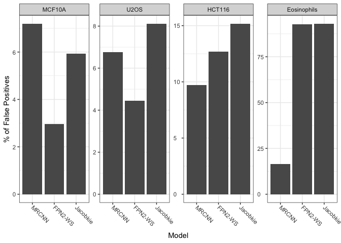
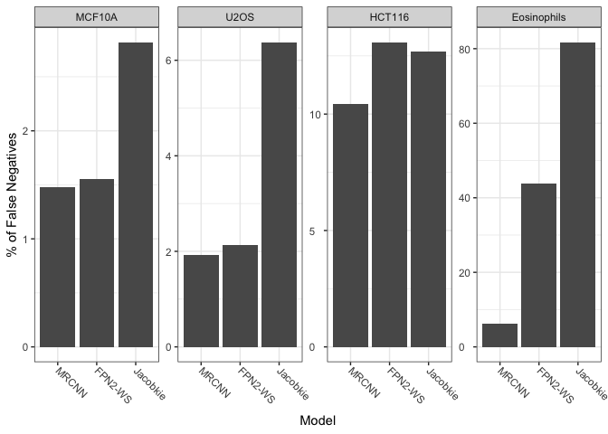
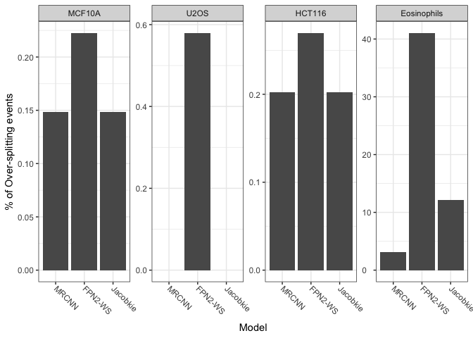
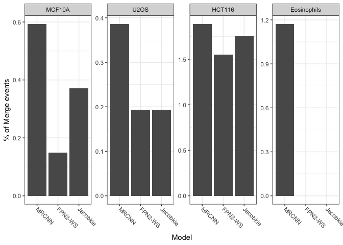

Generation of Figure S2
================
Jun 22 2020

``` r
library(tidyverse)
```

    ## ── Attaching packages ─────────────────────────────────────── tidyverse 1.3.0 ──

    ## ✓ ggplot2 3.3.1     ✓ purrr   0.3.4
    ## ✓ tibble  3.0.1     ✓ dplyr   1.0.0
    ## ✓ tidyr   1.1.0     ✓ stringr 1.4.0
    ## ✓ readr   1.3.1     ✓ forcats 0.5.0

    ## ── Conflicts ────────────────────────────────────────── tidyverse_conflicts() ──
    ## x dplyr::filter() masks stats::filter()
    ## x dplyr::lag()    masks stats::lag()

``` r
library(readr)
library(ggthemes)
```

Set `knitr` and `ggplot2` options.

``` r
knitr::opts_chunk$set(
    cache = FALSE,
    fig.path = "Output/",
    dev = c("png", "pdf"),
    message = FALSE,
    warning = FALSE
    )

theme_set(theme_bw())

theme_update(
  axis.text.x = element_text(
    angle = -45,
    hjust = 0,
    vjust = 0.5
  ),
  axis.text.y = element_text(hjust = 0)
)
```

Read the FN, FP, splits and merges data provided by George Zaki.

``` r
errors_df <- read_csv('Output/errors_cleaned.csv')
```

Calculate the error percentages

``` r
calc_perc <- function(a,b){
  return(100*(a/b))
}

levs1 <- c("MCF10A", "U2OS", "HCT116", "Eosinophils")
levs2 <- c("MRCNN", "FPN2-WS", "Jacobkie", "Kaggle_5th")

errors_df <- errors_df %>%
  mutate_at(c("FP", "FN", "merges", "splits"), ~calc_perc(., total)) %>%
  mutate(cell_line = factor(cell_line, levels = levs1),
         model = factor(model, levels = levs2))
```

<!-- --> <!-- -->
<!-- --> <!-- -->

``` r
sessionInfo()
```

    ## R version 3.6.3 (2020-02-29)
    ## Platform: x86_64-apple-darwin15.6.0 (64-bit)
    ## Running under: macOS Mojave 10.14.6
    ## 
    ## Matrix products: default
    ## BLAS:   /Library/Frameworks/R.framework/Versions/3.6/Resources/lib/libRblas.0.dylib
    ## LAPACK: /Library/Frameworks/R.framework/Versions/3.6/Resources/lib/libRlapack.dylib
    ## 
    ## locale:
    ## [1] en_US.UTF-8/en_US.UTF-8/en_US.UTF-8/C/en_US.UTF-8/en_US.UTF-8
    ## 
    ## attached base packages:
    ## [1] stats     graphics  grDevices utils     datasets  methods   base     
    ## 
    ## other attached packages:
    ##  [1] ggthemes_4.2.0  forcats_0.5.0   stringr_1.4.0   dplyr_1.0.0    
    ##  [5] purrr_0.3.4     readr_1.3.1     tidyr_1.1.0     tibble_3.0.1   
    ##  [9] ggplot2_3.3.1   tidyverse_1.3.0
    ## 
    ## loaded via a namespace (and not attached):
    ##  [1] tidyselect_1.1.0 xfun_0.13        haven_2.2.0      lattice_0.20-41 
    ##  [5] colorspace_1.4-1 vctrs_0.3.0      generics_0.0.2   htmltools_0.4.0 
    ##  [9] yaml_2.2.1       rlang_0.4.6      pillar_1.4.4     glue_1.4.1      
    ## [13] withr_2.2.0      DBI_1.1.0        dbplyr_1.4.3     modelr_0.1.7    
    ## [17] readxl_1.3.1     lifecycle_0.2.0  munsell_0.5.0    gtable_0.3.0    
    ## [21] cellranger_1.1.0 rvest_0.3.5      evaluate_0.14    labeling_0.3    
    ## [25] knitr_1.28       fansi_0.4.1      broom_0.5.6      Rcpp_1.0.4.6    
    ## [29] scales_1.1.1     backports_1.1.7  jsonlite_1.6.1   farver_2.0.3    
    ## [33] fs_1.4.1         hms_0.5.3        digest_0.6.25    stringi_1.4.6   
    ## [37] grid_3.6.3       cli_2.0.2        tools_3.6.3      magrittr_1.5    
    ## [41] crayon_1.3.4     pkgconfig_2.0.3  ellipsis_0.3.1   xml2_1.3.2      
    ## [45] reprex_0.3.0     lubridate_1.7.8  assertthat_0.2.1 rmarkdown_2.1   
    ## [49] httr_1.4.1       rstudioapi_0.11  R6_2.4.1         nlme_3.1-147    
    ## [53] compiler_3.6.3
