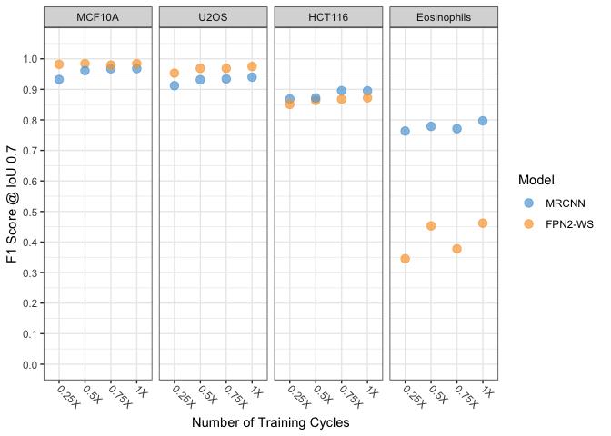
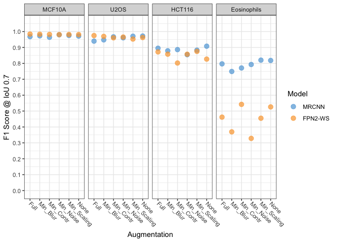

Generation of Figures 1 to S2 for the DL Nuclear Segmentation Manuscript
================
Jan 19 2021

### Analysis initialization

Load the required libraries

``` r
library(tidyverse)
```

    ## ── Attaching packages ───────────────────────────────────────────────────────────────────── tidyverse 1.3.0 ──

    ## ✓ ggplot2 3.3.2     ✓ purrr   0.3.4
    ## ✓ tibble  3.0.3     ✓ dplyr   1.0.2
    ## ✓ tidyr   1.1.2     ✓ stringr 1.4.0
    ## ✓ readr   1.3.1     ✓ forcats 0.5.0

    ## ── Conflicts ──────────────────────────────────────────────────────────────────────── tidyverse_conflicts() ──
    ## x dplyr::filter() masks stats::filter()
    ## x dplyr::lag()    masks stats::lag()

``` r
library(readr)
library(curl)
```

    ## 
    ## Attaching package: 'curl'

    ## The following object is masked from 'package:readr':
    ## 
    ##     parse_date

``` r
library(ggthemes)
```

Set `knitr` and `ggplot2` options.

``` r
knitr::opts_chunk$set(
    cache = FALSE,
    fig.path = "Output/",
    dev = c("png", "pdf"),
    message = FALSE,
    warning = FALSE
    )

theme_set(theme_bw())

theme_update(
  axis.text.x = element_text(
    angle = -45,
    hjust = 0,
    vjust = 0.5
  ),
  axis.text.y = element_text(hjust = 0)
)
```

### Read and process data and metadata

Define a function to calculate the F1 score based on the number of true
positives, false positives and false negatives.

``` r
calculate_F1 <- function(tp, fn, fp){
  tp/(tp + (fn + fp)/2)
}
```

Download unzip the input results of the inference experiments from
Figshare if they have not been already downoladed.

``` r
if(!dir.exists("Data")) {
  URL <- "https://ndownloader.figshare.com/files/24856241"
  curl_download(URL, "data.zip")
  unzip("data.zip")
}
```

Recursively read ands process all the data from all the models runs and
the manual vs. automated run. This is the data for both training and
testing results.

``` r
raw_tbl <- dir(path = "Data", 
               pattern = ".*maps\\.csv$", 
               recursive = TRUE,
               full.names = TRUE) %>%
  set_names() %>%
  map_df(read_csv, .id = "filename") %>%
  select(filename, 
         thres = `IoU(Threshold)`,
         TP = `Sum(all_tp)`,
         FP = `Sum(all_fp)`,
         FN = `Sum(all_fn)`,
         mAP = AP) %>%
  mutate(F1 = calculate_F1(tp = TP,
                           fn = FN,
                           fp = FP))
glimpse(raw_tbl)
```

    ## Rows: 10,700
    ## Columns: 7
    ## $ filename <chr> "Data/run-manual-vs-semi-auto/BABE_Biological_manual/maps.cs…
    ## $ thres    <dbl> 0.50, 0.55, 0.60, 0.65, 0.70, 0.75, 0.80, 0.85, 0.90, 0.95, …
    ## $ TP       <dbl> 1128, 1127, 1126, 1125, 1125, 1124, 1121, 1106, 945, 69, 135…
    ## $ FP       <dbl> 11, 12, 13, 14, 14, 15, 18, 33, 194, 1070, 80, 83, 88, 95, 1…
    ## $ FN       <dbl> 12, 13, 14, 15, 15, 16, 19, 34, 195, 1071, 81, 84, 89, 96, 1…
    ## $ mAP      <dbl> 0.980017376, 0.978298611, 0.976582827, 0.974870017, 0.974870…
    ## $ F1       <dbl> 0.989907854, 0.989030276, 0.988152699, 0.987275121, 0.987275…

Recode the values of the `cell_line` variable only for the model runs to
make them compatible with the actual cell names.

``` r
levs1 <- c("MCF10A", "U2OS", "HCT116", "Eosinophils")
levs2 <-
  c("Original",
    "Technical",
    "Biological",
    "Technical_manual",
    "Biological_manual")

runs_tbl <- raw_tbl %>%
  filter(!str_detect(filename, "manual-vs-semi-auto")) %>% #only model runs
  mutate(
    filename = str_replace(filename, "BABE", "MCF10A"),
    filename = str_replace(filename, "HiTIF_Colorectal", "HCT116"),
    filename = str_replace(filename, "HiTIF_Laurent", "U2OS"),
    filename = str_replace(filename, "Manasi", "Eosinophils"),
    run = as.numeric(str_match(filename, pattern = "run([0-9]{3})")[, 2]),
    cell_line = str_match(filename, pattern = "Data/.*?/.*?/.*?/(.*?)_.*?/")[, 2],
    replicate = str_match(filename, pattern = "Data/.*?/.*?/.*?/.*?_(.*?)/")[, 2],
    cell_line = factor(cell_line, levels = levs1),
    replicate = factor(replicate, levels = levs2)
  )

glimpse(runs_tbl)
```

    ## Rows: 10,660
    ## Columns: 10
    ## $ filename  <chr> "Data/run001/mean-average-precision/mrcnn/MCF10A_Biological…
    ## $ thres     <dbl> 0.50, 0.55, 0.60, 0.65, 0.70, 0.75, 0.80, 0.85, 0.90, 0.95,…
    ## $ TP        <dbl> 1116, 1114, 1113, 1110, 1110, 1108, 1102, 1081, 902, 56, 11…
    ## $ FP        <dbl> 28, 30, 31, 34, 34, 36, 42, 63, 242, 1088, 28, 31, 31, 33, …
    ## $ FN        <dbl> 24, 26, 27, 30, 30, 32, 38, 59, 238, 1084, 23, 26, 26, 28, …
    ## $ mAP       <dbl> 0.95547945, 0.95213675, 0.95046968, 0.94548552, 0.94548552,…
    ## $ F1        <dbl> 0.97723292, 0.97548161, 0.97460595, 0.97197898, 0.97197898,…
    ## $ run       <dbl> 1, 1, 1, 1, 1, 1, 1, 1, 1, 1, 1, 1, 1, 1, 1, 1, 1, 1, 1, 1,…
    ## $ cell_line <fct> MCF10A, MCF10A, MCF10A, MCF10A, MCF10A, MCF10A, MCF10A, MCF…
    ## $ replicate <fct> Biological_manual, Biological_manual, Biological_manual, Bi…

Recode the values of the `cell_line` variable only for the manual
vs. auomated run to make them compatible with the actual cell names.

``` r
manual_vs_auto_tbl <- raw_tbl %>%
  filter(str_detect(filename, "manual-vs-semi-auto")) %>% #only manual vs. semi-automated run
  mutate(
    filename = str_replace(filename, "BABE", "MCF10A"),
    filename = str_replace(filename, "HiTIF_Colorectal", "HCT116"),
    filename = str_replace(filename, "HiTIF_Laurent", "U2OS"),
    filename = str_replace(filename, "Manasi", "Eosinophils"),
    cell_line = str_match(filename, pattern = "Data/.*?/(.*?)_.*?/")[, 2],
    replicate = str_match(filename, pattern = "Data/.*?/.*?_(.*?)/")[, 2],
    cell_line = factor(cell_line, levels = levs1),
    replicate = factor(replicate, levels = levs2)
  )

glimpse(manual_vs_auto_tbl)
```

    ## Rows: 40
    ## Columns: 9
    ## $ filename  <chr> "Data/run-manual-vs-semi-auto/MCF10A_Biological_manual/maps…
    ## $ thres     <dbl> 0.50, 0.55, 0.60, 0.65, 0.70, 0.75, 0.80, 0.85, 0.90, 0.95,…
    ## $ TP        <dbl> 1128, 1127, 1126, 1125, 1125, 1124, 1121, 1106, 945, 69, 13…
    ## $ FP        <dbl> 11, 12, 13, 14, 14, 15, 18, 33, 194, 1070, 80, 83, 88, 95, …
    ## $ FN        <dbl> 12, 13, 14, 15, 15, 16, 19, 34, 195, 1071, 81, 84, 89, 96, …
    ## $ mAP       <dbl> 0.980017376, 0.978298611, 0.976582827, 0.974870017, 0.97487…
    ## $ F1        <dbl> 0.989907854, 0.989030276, 0.988152699, 0.987275121, 0.98727…
    ## $ cell_line <fct> MCF10A, MCF10A, MCF10A, MCF10A, MCF10A, MCF10A, MCF10A, MCF…
    ## $ replicate <fct> Biological_manual, Biological_manual, Biological_manual, Bi…

Read the run metadata table.

``` r
md_tbl <- read_csv("Metadata/Metadata.csv")

glimpse(md_tbl)
```

    ## Rows: 84
    ## Columns: 7
    ## $ run            <dbl> 1, 2, 3, 4, 5, 6, 7, 8, 9, 10, 11, 12, 13, 14, 15, 16,…
    ## $ train_set      <chr> "MCF10A", "MCF10A", "MCF10A", "MCF10A", "MCF10A", "All…
    ## $ train_size     <chr> "1X", "1X", "1X", "1X", "1X", "1X", "1X", "1X", "1X", …
    ## $ aug            <chr> "Full", "Full", "Full", "Full", "Full", "Full", "Full"…
    ## $ epochs         <chr> "1X", "1X", "1X", "1X", "1X", "1X", "1X", "1X", "1X", …
    ## $ model          <chr> "MRCNN", "Kaggle_5th", "MRCNN", "FPN2-WS", "FPN2-WS", …
    ## $ initialization <chr> "Pre-initialized", "Random", "Random", "Random", "Pre-…

Tidy up the metadata table for visual exploration.

``` r
md_explore <-
  md_tbl %>% select(model, initialization, train_set, train_size, epochs, aug, run) %>%
  arrange(model, initialization, train_set, train_size, epochs, aug, run)

knitr::kable(md_explore)
```

| model       | initialization  | train\_set           | train\_size | epochs | aug          | run |
|:------------|:----------------|:---------------------|:------------|:-------|:-------------|----:|
| CellPose    | Random          | CellPose             | 1X          | 1X     | Full         |  84 |
| FPN2-WS     | Pre-initialized | All                  | 0.125X      | 1X     | Full         |  49 |
| FPN2-WS     | Pre-initialized | All                  | 0.25X       | 1X     | Full         |  48 |
| FPN2-WS     | Pre-initialized | All                  | 0.5X        | 1X     | Full         |  47 |
| FPN2-WS     | Pre-initialized | All                  | 1X          | 0.25X  | Full         |  68 |
| FPN2-WS     | Pre-initialized | All                  | 1X          | 0.5X   | Full         |  12 |
| FPN2-WS     | Pre-initialized | All                  | 1X          | 0.5X   | Full         |  14 |
| FPN2-WS     | Pre-initialized | All                  | 1X          | 0.75X  | Full         |  67 |
| FPN2-WS     | Pre-initialized | All                  | 1X          | 1X     | Full         |  10 |
| FPN2-WS     | Pre-initialized | All                  | 1X          | 1X     | Full         |  58 |
| FPN2-WS     | Pre-initialized | All                  | 1X          | 1X     | Full         |  59 |
| FPN2-WS     | Pre-initialized | All                  | 1X          | 1X     | Full         |  60 |
| FPN2-WS     | Pre-initialized | All                  | 1X          | 1X     | Min\_Blur    |  70 |
| FPN2-WS     | Pre-initialized | All                  | 1X          | 1X     | Min\_Contr   |  69 |
| FPN2-WS     | Pre-initialized | All                  | 1X          | 1X     | Min\_Noise   |  71 |
| FPN2-WS     | Pre-initialized | All                  | 1X          | 1X     | Min\_Scaling |  72 |
| FPN2-WS     | Pre-initialized | All                  | 1X          | 1X     | None         |  61 |
| FPN2-WS     | Pre-initialized | All                  | 1X          | 1X     | None         |  62 |
| FPN2-WS     | Pre-initialized | All                  | 1X          | 1X     | None         |  63 |
| FPN2-WS     | Pre-initialized | All                  | 1X          | 1X     | None         |  64 |
| FPN2-WS     | Pre-initialized | All                  | 2X          | 1X     | Full         |  11 |
| FPN2-WS     | Pre-initialized | All                  | 2X          | 1X     | Full         |  13 |
| FPN2-WS     | Pre-initialized | MCF10A               | 1X          | 1X     | Full         |   5 |
| FPN2-WS     | Pre-initialized | MCF10A\_HCT116       | 1X          | 1X     | Full         |  65 |
| FPN2-WS     | Pre-initialized | MCF10A\_HCT116\_U2OS | 1X          | 1X     | Full         |  66 |
| FPN2-WS     | Random          | All                  | 1X          | 1X     | Full         |   9 |
| FPN2-WS     | Random          | All                  | 1X          | 1X     | Full         |  50 |
| FPN2-WS     | Random          | All                  | 1X          | 1X     | Full         |  51 |
| FPN2-WS     | Random          | All                  | 1X          | 1X     | Full         |  52 |
| FPN2-WS     | Random          | All                  | 1X          | 1X     | Full         |  53 |
| FPN2-WS     | Random          | All                  | 1X          | 1X     | None         |  54 |
| FPN2-WS     | Random          | All                  | 1X          | 1X     | None         |  55 |
| FPN2-WS     | Random          | All                  | 1X          | 1X     | None         |  56 |
| FPN2-WS     | Random          | All                  | 1X          | 1X     | None         |  57 |
| FPN2-WS     | Random          | MCF10A               | 1X          | 1X     | Full         |   4 |
| Jacobkie    | Random          | BBBC038              | 1X          | 1X     | Full         |  44 |
| Kaggle\_5th | Pre-initialized | All                  | 1X          | 1X     | Full         |   7 |
| Kaggle\_5th | Pre-initialized | BBBC038              | 1X          | 1X     | Full         |  21 |
| Kaggle\_5th | Random          | MCF10A               | 1X          | 1X     | Full         |   2 |
| MRCNN       | Pre-initialized | All                  | 0.125X      | 1X     | Full         |  46 |
| MRCNN       | Pre-initialized | All                  | 0.25X       | 1X     | Full         |  45 |
| MRCNN       | Pre-initialized | All                  | 0.5X        | 1X     | Full         |  19 |
| MRCNN       | Pre-initialized | All                  | 1X          | 0.25X  | Full         |  16 |
| MRCNN       | Pre-initialized | All                  | 1X          | 0.5X   | Full         |  17 |
| MRCNN       | Pre-initialized | All                  | 1X          | 0.75X  | Full         |  18 |
| MRCNN       | Pre-initialized | All                  | 1X          | 1X     | Full         |   6 |
| MRCNN       | Pre-initialized | All                  | 1X          | 1X     | Full         |  26 |
| MRCNN       | Pre-initialized | All                  | 1X          | 1X     | Full         |  32 |
| MRCNN       | Pre-initialized | All                  | 1X          | 1X     | Full         |  33 |
| MRCNN       | Pre-initialized | All                  | 1X          | 1X     | Min\_Blur    |  23 |
| MRCNN       | Pre-initialized | All                  | 1X          | 1X     | Min\_Contr   |  22 |
| MRCNN       | Pre-initialized | All                  | 1X          | 1X     | Min\_Noise   |  24 |
| MRCNN       | Pre-initialized | All                  | 1X          | 1X     | Min\_Scaling |  25 |
| MRCNN       | Pre-initialized | All                  | 1X          | 1X     | None         |  27 |
| MRCNN       | Pre-initialized | All                  | 1X          | 1X     | None         |  37 |
| MRCNN       | Pre-initialized | All                  | 1X          | 1X     | None         |  38 |
| MRCNN       | Pre-initialized | All                  | 1X          | 1X     | None         |  39 |
| MRCNN       | Pre-initialized | All                  | 2X          | 1X     | Full         |  20 |
| MRCNN       | Pre-initialized | Eosinophils          | 0.25X       | 1X     | Full         |  15 |
| MRCNN       | Pre-initialized | Eosinophils          | 1X          | 1X     | Full         |  28 |
| MRCNN       | Pre-initialized | MCF10A               | 1X          | 1X     | Full         |   1 |
| MRCNN       | Pre-initialized | MCF10A               | 1X          | 1X     | Full         |  31 |
| MRCNN       | Pre-initialized | MCF10A\_HCT116       | 1X          | 1X     | Full         |  29 |
| MRCNN       | Pre-initialized | MCF10A\_HCT116\_U2OS | 1X          | 1X     | Full         |  30 |
| MRCNN       | Random          | All                  | 1X          | 1X     | Full         |   8 |
| MRCNN       | Random          | All                  | 1X          | 1X     | Full         |  34 |
| MRCNN       | Random          | All                  | 1X          | 1X     | Full         |  35 |
| MRCNN       | Random          | All                  | 1X          | 1X     | Full         |  36 |
| MRCNN       | Random          | All                  | 1X          | 1X     | Full         |  73 |
| MRCNN       | Random          | All                  | 1X          | 1X     | Full         |  74 |
| MRCNN       | Random          | All                  | 1X          | 1X     | Full         |  75 |
| MRCNN       | Random          | All                  | 1X          | 1X     | Full         |  76 |
| MRCNN       | Random          | All                  | 1X          | 1X     | Full         |  77 |
| MRCNN       | Random          | All                  | 1X          | 1X     | Full         |  78 |
| MRCNN       | Random          | All                  | 1X          | 1X     | Full         |  79 |
| MRCNN       | Random          | All                  | 1X          | 1X     | Full         |  80 |
| MRCNN       | Random          | All                  | 1X          | 1X     | Full         |  81 |
| MRCNN       | Random          | All                  | 1X          | 1X     | Full         |  82 |
| MRCNN       | Random          | All                  | 1X          | 1X     | Full         |  83 |
| MRCNN       | Random          | All                  | 1X          | 1X     | None         |  40 |
| MRCNN       | Random          | All                  | 1X          | 1X     | None         |  41 |
| MRCNN       | Random          | All                  | 1X          | 1X     | None         |  42 |
| MRCNN       | Random          | All                  | 1X          | 1X     | None         |  43 |
| MRCNN       | Random          | MCF10A               | 1X          | 1X     | Full         |   3 |

Reorder some factors and join the model runs table with the metadata
table. Keep only the data for the test dataset runs and not for the
training/evaluation dataset runs.

``` r
levs3 <- c("Random", "Pre-initialized")
levs4 <-
  c("MCF10A",
    "Eosinophils",
    "MCF10A_HCT116",
    "MCF10A_HCT116_U2OS",
    "All",
    "BBBC038",
    "CellPose")
levs5 <- c("MRCNN", "FPN2-WS", "Jacobkie", "CellPose", "Kaggle_5th")


runs_tbl <- runs_tbl %>%
  left_join(md_tbl, by = c("run")) %>%
  mutate(
    initialization = factor(initialization, levels = levs3),
    train_set = factor(train_set, levels = levs4),
    train_size = factor(train_size),
    run = factor(run),
    aug = factor(aug),
    epochs = factor(epochs),
    model = factor(model, levels = levs5)
  ) 

glimpse(runs_tbl)
```

    ## Rows: 10,660
    ## Columns: 16
    ## $ filename       <chr> "Data/run001/mean-average-precision/mrcnn/MCF10A_Biolo…
    ## $ thres          <dbl> 0.50, 0.55, 0.60, 0.65, 0.70, 0.75, 0.80, 0.85, 0.90, …
    ## $ TP             <dbl> 1116, 1114, 1113, 1110, 1110, 1108, 1102, 1081, 902, 5…
    ## $ FP             <dbl> 28, 30, 31, 34, 34, 36, 42, 63, 242, 1088, 28, 31, 31,…
    ## $ FN             <dbl> 24, 26, 27, 30, 30, 32, 38, 59, 238, 1084, 23, 26, 26,…
    ## $ mAP            <dbl> 0.95547945, 0.95213675, 0.95046968, 0.94548552, 0.9454…
    ## $ F1             <dbl> 0.97723292, 0.97548161, 0.97460595, 0.97197898, 0.9719…
    ## $ run            <fct> 1, 1, 1, 1, 1, 1, 1, 1, 1, 1, 1, 1, 1, 1, 1, 1, 1, 1, …
    ## $ cell_line      <fct> MCF10A, MCF10A, MCF10A, MCF10A, MCF10A, MCF10A, MCF10A…
    ## $ replicate      <fct> Biological_manual, Biological_manual, Biological_manua…
    ## $ train_set      <fct> MCF10A, MCF10A, MCF10A, MCF10A, MCF10A, MCF10A, MCF10A…
    ## $ train_size     <fct> 1X, 1X, 1X, 1X, 1X, 1X, 1X, 1X, 1X, 1X, 1X, 1X, 1X, 1X…
    ## $ aug            <fct> Full, Full, Full, Full, Full, Full, Full, Full, Full, …
    ## $ epochs         <fct> 1X, 1X, 1X, 1X, 1X, 1X, 1X, 1X, 1X, 1X, 1X, 1X, 1X, 1X…
    ## $ model          <fct> MRCNN, MRCNN, MRCNN, MRCNN, MRCNN, MRCNN, MRCNN, MRCNN…
    ## $ initialization <fct> Pre-initialized, Pre-initialized, Pre-initialized, Pre…

Separate testing datasets from training datasets.

``` r
testing_tbl <- runs_tbl %>%
  #only test datasets
  filter(replicate != "Original") %>% 
  # only the `biological` replicate for MCF10 cells
  filter(!(cell_line == "MCF10A" & replicate == "Technical")) 

glimpse(testing_tbl)
```

    ## Rows: 6,540
    ## Columns: 16
    ## $ filename       <chr> "Data/run001/mean-average-precision/mrcnn/MCF10A_Biolo…
    ## $ thres          <dbl> 0.50, 0.55, 0.60, 0.65, 0.70, 0.75, 0.80, 0.85, 0.90, …
    ## $ TP             <dbl> 1116, 1114, 1113, 1110, 1110, 1108, 1102, 1081, 902, 5…
    ## $ FP             <dbl> 28, 30, 31, 34, 34, 36, 42, 63, 242, 1088, 28, 31, 31,…
    ## $ FN             <dbl> 24, 26, 27, 30, 30, 32, 38, 59, 238, 1084, 23, 26, 26,…
    ## $ mAP            <dbl> 0.95547945, 0.95213675, 0.95046968, 0.94548552, 0.9454…
    ## $ F1             <dbl> 0.97723292, 0.97548161, 0.97460595, 0.97197898, 0.9719…
    ## $ run            <fct> 1, 1, 1, 1, 1, 1, 1, 1, 1, 1, 1, 1, 1, 1, 1, 1, 1, 1, …
    ## $ cell_line      <fct> MCF10A, MCF10A, MCF10A, MCF10A, MCF10A, MCF10A, MCF10A…
    ## $ replicate      <fct> Biological_manual, Biological_manual, Biological_manua…
    ## $ train_set      <fct> MCF10A, MCF10A, MCF10A, MCF10A, MCF10A, MCF10A, MCF10A…
    ## $ train_size     <fct> 1X, 1X, 1X, 1X, 1X, 1X, 1X, 1X, 1X, 1X, 1X, 1X, 1X, 1X…
    ## $ aug            <fct> Full, Full, Full, Full, Full, Full, Full, Full, Full, …
    ## $ epochs         <fct> 1X, 1X, 1X, 1X, 1X, 1X, 1X, 1X, 1X, 1X, 1X, 1X, 1X, 1X…
    ## $ model          <fct> MRCNN, MRCNN, MRCNN, MRCNN, MRCNN, MRCNN, MRCNN, MRCNN…
    ## $ initialization <fct> Pre-initialized, Pre-initialized, Pre-initialized, Pre…

Select only the F1 values for IoU = 0.7 (As in [the KAGGLE ’18 nucleus
challenge paper](https://paperpile.com/shared/xZiVUo)).

``` r
testing_07_tbl <- testing_tbl %>%
             filter(round(thres, digits = 2) == 0.70, 
                    replicate %in% c("Technical", "Biological"))
```

### Plotting and Table Generating functions

``` r
gen_line <- function(df) {
  df %>%
  ggplot(aes(
    x = thres,
    y = F1,
    color = cell_line
  )) +
    geom_line() +
    geom_vline(xintercept = 0.7,
               linetype = "longdash",
               color = "grey60") +
    facet_wrap(vars(model)) +
    scale_linetype_discrete("Replicate") +
    scale_color_few(name = "Cell Line") +
    xlab("IoU Threshold") +
    ylab("F1 Score")
}


gen_point <- function(df, varx, x_legend){
  df %>% 
    ggplot(aes(x = {{varx}},
               y = F1,
               color = model)) +
    geom_point(alpha = 0.7,
               size = 3) +
    scale_y_continuous(lim = c(0, 1.05), 
                       breaks = seq(0, 1, 0.1)) +
    scale_color_few(name = "Model") +
    facet_wrap(vars(.data$cell_line),
                    nrow = 1) +
    xlab(x_legend) +
    ylab("F1 Score @ IoU 0.7")
}
```

``` r
gen_table <- function(df, varx){
  df %>%
    filter(round(.data$thres, digits = 2) %in% c(0.70, 0.9)) %>%
    select(.data$model, .data$cell_line, {{varx}}, .data$F1) %>%
    pivot_wider(
      names_from = c(.data$model, {{varx}}),
      values_from = .data$F1,
      names_sep = "-"
    )
}
```

### Figure 2

Create a subset of testing F1 results for the baseline models.

``` r
fig_2B <- testing_tbl %>%
  filter(run %in% c(3, 4),
         replicate %in% c("Technical", "Biological"))
```

Plot the baseline model training performance using only MCF10A cells
images for training and using random weights (Fig. 2B).
<!-- -->

Generate and save a table for the F1 results shown in Fig 2B at the 0.7
and 0.9 thresholds (Table1).

``` r
table1 <- gen_table(fig_2B, thres)

write_csv(table1, path = "Output/Table1.csv")
```

### Figure 3

Create a subset of F1 testing results for the experiments where we
tested changes to the model inizialization.

``` r
fig_3A <- testing_07_tbl %>% 
  filter(run %in% c(1, 3, 4, 5))
```

Plot only the effect of changes to initialization (Fig. 3A).
<!-- -->

Generate and save a table for the F1 results shown in Fig 3A at the 0.7
threshold (Table2).

``` r
table2 <- gen_table(fig_3A, initialization)

write_csv(table2, path = "Output/Table2.csv")
```

Create a subset of F1 testing results for the experiments where we
tested changes to the composition of the training datasets (Fig.3B).

``` r
fig_3B <- testing_07_tbl %>% 
  filter(run %in% c(1, 5, 6, 10, 29, 30, 65, 66)) 
```

Plot only the effect of incremental training (Fig. 3B).
<!-- -->

Generate and save a table for the F1 results shown in Fig 3B at the 0.7
threshold (Table3).

``` r
table3 <- gen_table(fig_3B, train_set)

write_csv(table3, path = "Output/Table3.csv")
```

### Figure 4

Create a subset of F1 testing results for the experiments where we
tested changes in the length of model training (Fig.4A).

``` r
fig_4A <- testing_07_tbl %>% 
  filter(run %in% c(6, 10, 12, 16, 17, 18, 67, 68))
```

Plot only the effect of incremental length of training (Fig. 4A).
<!-- -->

Generate and save a table for the F1 results shown in Fig 4A at the 0.7
threshold (Table4).

``` r
table4 <- gen_table(fig_4A, epochs)

write_csv(table4, path = "Output/Table4.csv")
```

Create a subset of F1 testing results for the experiments where we
tested changing the number of augmented ROI patches used for training
(Fig.4B).

``` r
fig_4B <- testing_07_tbl %>% 
  filter(run %in% c(6, 10, 11, 19, 20, 45:49))
```

Plot only the effect of incremental size of the training set (Fig. 4B).
<!-- -->

Generate and save a table for the F1 results shown in Fig 4B at the 0.7
threshold (Table5).

``` r
table5 <- gen_table(fig_4B, train_size)

write_csv(table5, path = "Output/Table5.csv")
```

Create a subset of F1 testing results for the experiments where we
tested changing the augmentation strategy used for image preprocessing
(Fig.4C).

``` r
fig_4C <- testing_07_tbl %>% 
  filter(run %in% c(6, 10, 22:25, 27, 62, 69:72))
```

Plot only the effect of changing the augmentation strategies (Fig. 4C).
<!-- --> Generate and save a table for the F1
results shown in Fig 4C at the 0.7 threshold (Table6).

``` r
table6 <- gen_table(fig_4C, aug)

write_csv(table6, path = "Output/Table6.csv")
```

Create a subset of F1 testing results for the experiments where we
tested changing the number of augmented ROI patches used for training
augmentations experiments and inizializations several times
(i.e. repeats) (Fig.4D).

``` r
fig_4D <- testing_07_tbl %>% 
  filter(run %in% c(6, 8, 10, 26, 32, 33:43, 50:64, 73:83))
```

Plot the effect of changing the augmentation strategies and
inizializations several times (Fig. 4D). <!-- -->

Generate and save a table for the F1 results mean and 95% Confidence
Interval as shown in Fig 4C at the 0.7 threshold (Table7).

``` r
table7 <- fig_4D %>%
  group_by(cell_line, aug, initialization, model) %>%
  summarize(CI_95 = list(Hmisc::smean.cl.normal(F1))) %>%
  unnest_wider(CI_95) %>%
  rename(F1_mean = Mean,
         CI_95_lower = Lower,
         CI_95_upper = Upper)

write_csv(table7, "Output/Table7.csv")
```

### Figure 5

Create a subset of F1 testing results for the final models (Runs 10 for
FPN2-WS and 37 for MRCNN) and comparison with the out-of-the-box
Jacobkie model (Run 44) (Fig. 5B).

``` r
fig_5B <- testing_tbl %>% 
  filter(run %in% c(10, 37, 44),
         replicate %in% c("Technical", "Biological"))
```

Plot the performance for the final MRCNN and FPN2-WS models comparing it
with Jacobkie. This is Fig. 5B. <!-- -->

Generate and save a table for the F1 results shown in Fig 5B at the 0.7
and 0.9 thresholds (Table8).

``` r
table8 <- gen_table(fig_5B, thres)

write_csv(table8, path = "Output/Table8.csv")
```

### Figure S1B

Create a subset of F1 testing results for the final models (Runs 10 for
FPN2-WS and 37 for MRCNN) and comparison with the out-of-the-box
Jacobkie model (Run 44) using both semi-automated and manual labelling
(Fig. S1B).

``` r
fig_S1B <- testing_tbl %>% 
               filter(run %in% c(10, 37, 44)) %>%
               mutate(annotation = ifelse(str_detect(replicate, "manual"), "Manual", "Semi-Automated"))
```

Plot the performance for the final MRCNN and FPN2-WS models comparing it
with Jacobkie (Run 44) using both semi-automated generated labels and
manually annotated labels. This is Fig. S1B.
<!-- -->

Generate and save a table for the F1 results shown in Fig S1B at the 0.7
and 0.9 thresholds.

``` r
tableS3 <- fig_S1B %>%
  filter(round(thres, digits = 2) %in% c(0.70, 0.9)) %>%
  select(model,annotation, cell_line, thres, F1) %>%
  pivot_wider(names_from = c(model, annotation, thres),
              values_from = F1,
              names_sep = "-")

write_csv(tableS3, path = "Output/TableS3.csv")
```

### Figure S2A

Plot Fig S2A: comparison of the manual vs. semi-automated labelling
strategy. <!-- -->

### Figure S2B

Create a subset of F1 testing results for the final models (Runs 10 for
FPN2-WS and 37 for MRCNN) using either the F1 training or testing
inference results (Fig. S2B).

``` r
fig_S2B <- runs_tbl %>%
  filter(run %in% c(10, 37),
         replicate %in% c("Original", "Technical", "Biological")) %>%
  filter(!(cell_line == "MCF10A" & replicate == "Technical")) %>%      
  mutate(replicate = if_else(str_detect(replicate, "Original"), "Training", "Testing")) %>%
  mutate(replicate = factor(replicate, levels = c("Training", "Testing"))) 
```

Plot Fig. S2B. <!-- -->

Generate and save a table for the F1 results shown in Fig S2B at the 0.7
and 0.9 thresholds (Table S4).

``` r
tableS4 <- fig_S2B %>%
  filter(round(thres, digits = 2) %in% c(0.70, 0.9)) %>%
  select(model, replicate, cell_line, thres, F1) %>%
  pivot_wider(names_from = c(model, replicate, thres),
              values_from = F1,
              names_sep = "-")

write_csv(tableS4, path = "Output/TableS4.csv")
```

Bonus: comparison of MRCNN and FPN-WS2 performance with (Cellpose)
\[<https://cellpose.readthedocs.io/en/latest/>\]

``` r
cell_pose <- testing_tbl %>% 
  filter(run %in% c(10, 37, 44, 84),
         replicate %in% c("Technical", "Biological"))
```

<!-- -->

``` r
cell_pose_table <- gen_table(cell_pose, thres)

write_csv(cell_pose_table, path = "Output/cell_pose_table.csv")
```

``` r
sessionInfo()
```

    ## R version 4.0.3 (2020-10-10)
    ## Platform: x86_64-apple-darwin17.0 (64-bit)
    ## Running under: macOS Catalina 10.15.7
    ## 
    ## Matrix products: default
    ## BLAS:   /Library/Frameworks/R.framework/Versions/4.0/Resources/lib/libRblas.dylib
    ## LAPACK: /Library/Frameworks/R.framework/Versions/4.0/Resources/lib/libRlapack.dylib
    ## 
    ## locale:
    ## [1] en_US.UTF-8/en_US.UTF-8/en_US.UTF-8/C/en_US.UTF-8/en_US.UTF-8
    ## 
    ## attached base packages:
    ## [1] stats     graphics  grDevices datasets  utils     methods   base     
    ## 
    ## other attached packages:
    ##  [1] ggthemes_4.2.0  curl_4.3        forcats_0.5.0   stringr_1.4.0  
    ##  [5] dplyr_1.0.2     purrr_0.3.4     readr_1.3.1     tidyr_1.1.2    
    ##  [9] tibble_3.0.3    ggplot2_3.3.2   tidyverse_1.3.0
    ## 
    ## loaded via a namespace (and not attached):
    ##  [1] httr_1.4.2          jsonlite_1.7.1      splines_4.0.3      
    ##  [4] modelr_0.1.8        Formula_1.2-3       assertthat_0.2.1   
    ##  [7] highr_0.8           latticeExtra_0.6-29 blob_1.2.1         
    ## [10] renv_0.12.0         cellranger_1.1.0    yaml_2.2.1         
    ## [13] pillar_1.4.6        backports_1.1.10    lattice_0.20-41    
    ## [16] glue_1.4.2          digest_0.6.25       checkmate_2.0.0    
    ## [19] RColorBrewer_1.1-2  rvest_0.3.6         colorspace_1.4-1   
    ## [22] htmltools_0.5.0     Matrix_1.2-18       pkgconfig_2.0.3    
    ## [25] broom_0.7.0         haven_2.3.1         scales_1.1.1       
    ## [28] jpeg_0.1-8.1        htmlTable_2.1.0     generics_0.0.2     
    ## [31] farver_2.0.3        ellipsis_0.3.1      withr_2.2.0        
    ## [34] nnet_7.3-14         cli_2.0.2           survival_3.2-7     
    ## [37] magrittr_1.5        crayon_1.3.4        readxl_1.3.1       
    ## [40] evaluate_0.14       fs_1.5.0            fansi_0.4.1        
    ## [43] xml2_1.3.2          foreign_0.8-80      data.table_1.13.0  
    ## [46] tools_4.0.3         hms_0.5.3           lifecycle_0.2.0    
    ## [49] munsell_0.5.0       reprex_0.3.0        cluster_2.1.0      
    ## [52] compiler_4.0.3      rlang_0.4.7         grid_4.0.3         
    ## [55] rstudioapi_0.11     htmlwidgets_1.5.1   base64enc_0.1-3    
    ## [58] labeling_0.3        rmarkdown_2.6       gtable_0.3.0       
    ## [61] DBI_1.1.0           R6_2.4.1            gridExtra_2.3      
    ## [64] lubridate_1.7.9     knitr_1.29          utf8_1.1.4         
    ## [67] Hmisc_4.4-1         stringi_1.5.3       Rcpp_1.0.5         
    ## [70] vctrs_0.3.4         rpart_4.1-15        png_0.1-7          
    ## [73] dbplyr_1.4.4        tidyselect_1.1.0    xfun_0.17
